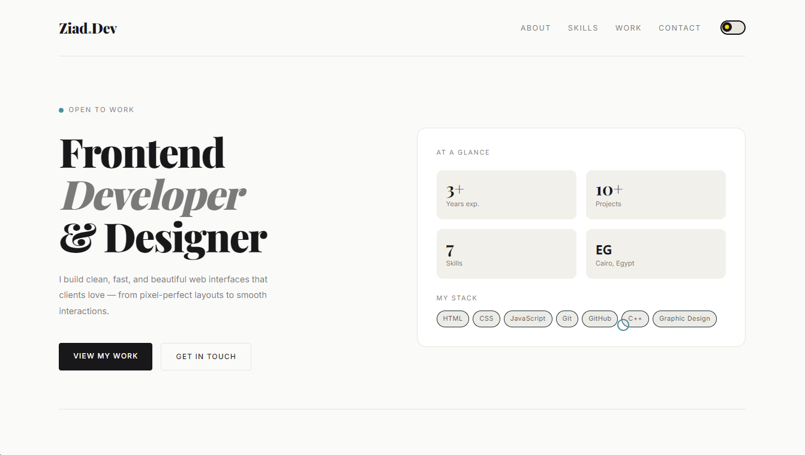
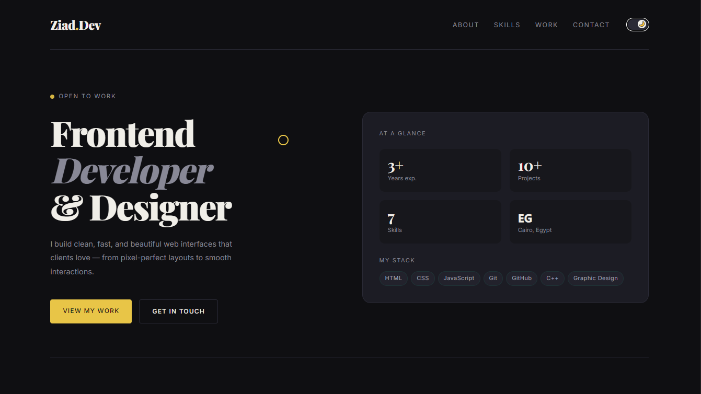

# Ziad Waleed - Personal Portfolio 🚀

A modern, minimalist personal portfolio designed to showcase skills and projects with a focus on clean typography, smooth interactions, and a professional user experience.

## 🌟 Key Features

* **Adaptive Theme (Dark/Light Mode):** Seamless switching between dark and light themes with optimized color palettes.
* **Custom Interactive Cursor:** A specialized circular cursor that follows movement and expands when hovering over interactive elements like links and buttons.
* **Dynamic Skills Generation:** Skills and proficiency levels are rendered dynamically via JavaScript, featuring entrance loading animations for progress bars.
* **Selected Work Gallery:** A clean grid layout showcasing key projects with hover effects and responsive design.
* **Fully Responsive Layout:** Optimized for all devices, from mobile screens to large desktop monitors.
* **Modern Tech Stack UI:** Professional dashboard-style "At a Glance" section highlighting experience and core technologies.

## 🛠️ Built With

* **HTML5:** Semantic structure for the web.
* **CSS3:** Advanced styling using CSS variables, Flexbox, Grid, and smooth transitions.
* **JavaScript (Vanilla):** Logic for theme toggling, custom cursor tracking, and dynamic content rendering.
* **Google Fonts:** Utilizing *Playfair Display* for headings and *Inter* for body text.

## 📁 Project Structure

```text
├── index.html   # Core structure and content
├── style.css    # UI styling, themes, and animations
└── script.js    # Interactivity, theme logic, and dynamic skills

| Light Mode | Dark Mode |
|---|---|
|  |  |
